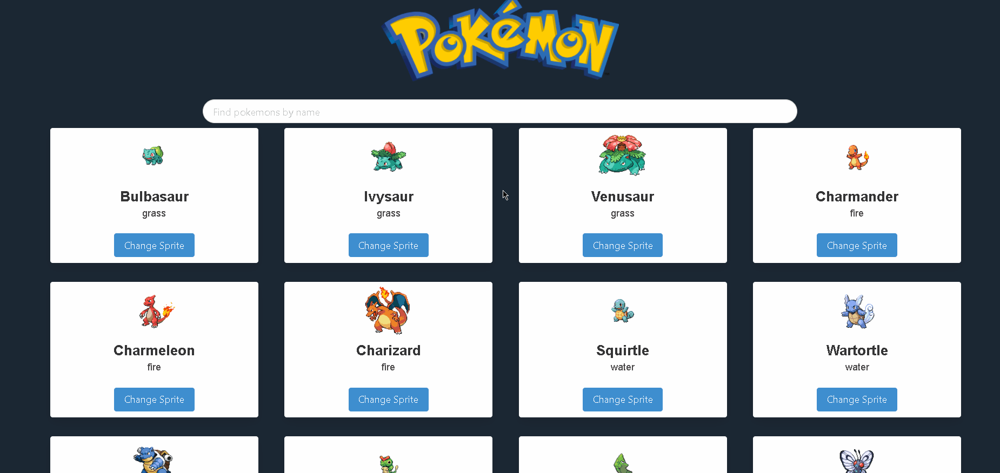

# Pokédex
<br>
<div align="center">


  


</div>



> This is a simple website that shows some pokemons and their informations.
## 💻 Prerequisites

Before start, make sure you meet these requirements:

* You have installed the latest stable version of `Vue CLI` 

## 🚀 Project Setup

To install, follow these steps:

Clone the project and run the command in the root directory:
```
npm install
```

## ☕ Using Pokédex

### Compiles and hot-reloads for development
```
npm run serve
```

### Compiles and minifies for production
```
npm run build
```

### Lints and fixes files
```
npm run lint
```
## 📫 Contributing for Pokédex

To contribute, follow these steps:

1. Fork this repository.
2. Create a branch with your feature name: `git checkout -b mynewfeature`.
3. Make your changes and confirm: `git commit -m 'messagehere'`
4. Push your change to the original branch: `git push origin mynewfeature`
5. Create the pull request.


[⬆ Go back to the top!](#Pokédex)
